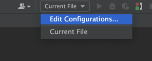

# Docker окружения для bitrix

## Запуск

1. Скопировать файл `./docker/.env.example` в `./docker/.env`
2. Задать переменные
    - `COMPOSE_PROJECT_NAME` - имя проекта, используется для изоляции
    - `ARCH` - костыль для Mac, для остальных систем нужно удалять
    - `DOCUMENT_ROOT` - путь к проекту
    - `HTTP_PORT` и `HTTPS_PORT` - очевидно из названий, порту по которым будут доступны nginx и apache
    - `PHP_VERSION` - версия php которая будет запущена, вводить имя папки с нужным Dockerfile
    - `MYSQL_PORT` - так же очевидно, порт по которому доступен mysql сервер
3. Собственно запустить `docker-compose up -d -build`

## Немного автоматизации для PhpStorm

В силу того что цивилизация дало нам эту великолепную ide(**КОТОРУЮ ТЫ КУПИЛ!!!**). 
Можно использовать ее великолепные возможности.

### Настройка run

Первое, что нужно сделать это настроить run для запуска docker-compose.
Идем в run PhpStorm, нажимаем Edit Configurations.

Создаем конфиг для Docker-compose.

Указываем путь к docker-compose.yml файлу, 
сервисы которые необходимо запускать (рекомендуется все сервисы без node, node пока в разработке).

UPD - Обязательно для каждого проекта задать свое имя проекта в PhpStorm через modify options, т.к.
проявился баг при быстром переключении проектов через run. Банально не заводилось через run если не было задано 
уникальное имя проекта именно через modify options

Готово, у нас есть сервис, который подымается одной кнопкой run в PhpStorm.

Как использовать `./docker/docker-stop.sh` догадаетесь сами.
Единственная подсказка, это то что он используется так же в run PhpStorm.

## P.S.

Если пытаетесь обратиться к одному контейнеру из другого, например к базе из apache, логично использовать localhost, но это не так.
Нужно указывать имя сервиса, т.е db.